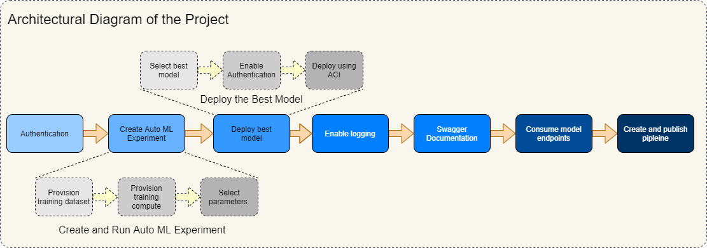

*NOTE:* This file is a template that you can use to create the README for your project. The *TODO* comments below will highlight the information you should be sure to include.

<!-- #region -->
#  Project 2 - Creating and Consuming an Azure Auto ML experiment

*TODO:* Write an overview to your project.

This project encompases most common steps in creating Azure Auto ML experiment and consuming it. Two approaches were used, the first showing how the whole process is performed using Azure ML Studio and the second was using Python Azure SDK. The first approach is regarded as low-code-no-code experience and the second is demonstrating how the same scenario can be accompliched through coding in Python SDK for Azure ML.

Despite small differences, both approaches have the same steps:

- Authentication, to use Azure ML resources,
- Creating Automated ML Experiment, with result of generating Auto ML model,
- Deploying the best model created during Auto ML Experimetn Run,
- Enabling logging to be used for monitoring, performance improvements and debugging
- Consuming deployed models' endpoints and utilizing Swagger tool, and
- Creating and publishing pipeline.

Ahother key point of the Project was to illustrate use of pipelines aspects, which is commonly known as Pipleine Automation. From efforts to automate pipelines we may conclude that machine learning operations can benefit greatly. Automation is important pillar of DevOps and it's principles and practices applied to machine learning and called MLOps for short.

For the purpose of training the model, public data set "Bank Marketing" was used. This dataset was provided as URI containing csv file with records of data colected during direct marketing phone campaigns of banking inistitution. We were required to use Auto ML feature of Azure ML. Auto ML is freeing machine learning professionals from task of sellecting the best performing model. Instead of focusing on selecting and tuning the model, which is most suitable to make predictions, machine learning professionals can focus on operationalizing and delivering result to end customer. Classification goal was to predict will or will not the client subscribe to term deposit, designated with variable 'y' and values 'yes'/'no'.

Some areas for future improvements may be to set triggers to retrain the model when another (improved) dataset is available. For this purpose we would be needing to create Azure Logic App, provide condition, interval/frequency and URI of HTTP endpoint of the published pipeline. Another area of improvement may be setting Application Insights monitoring for Metrics of endpoints and setting Alerts, for instance on Failed Requests at web server. We may use metrics for performance improvements measures and alerts may be utilized to inform IT system staff about problems with deployed service, while some situations may be remedied by Azure automation.

## Architectural Diagram
*TODO*: Provide an architectual diagram of the project and give an introduction of each step.

## Key Steps
*TODO*: Write a short discription of the key steps. Remeber to include all the screencasts required to demonstrate key steps.

1. Creeate Service Principal and allow acces to workspace

This step accociates SP account with workspace.
Screen
Screen

2. Create and run Auto ML Experiment

This step will provide a model we will deploy and consume. We need to provide some information through the form including the dataset we mentioned earlier.
Screen

We will deploy new compute cluster and select number of nodes stipulated by project instructions. Checkbox for "Explain the best model" should be thicked and Concurrency adjusted to be one less than number of compute cluster. After the experiment finishes, we will have the best trained model.
Screen
Screen

3. Deploy the Best Model

After completion of this step we will be able to interact with model by HTTP API service. To test this we will besending data over POST requests to the endpoint.
Screen?

4. Enable Application Insights

This step will allow us to retrieve logs after best model deployment. We will do this by running a piece of Python code from terminal window in order to enable Application Insights for the model. After verification of active Application Insights 

*TODO* Remeber to provide screenshots of the `RunDetails` widget as well as a screenshot of the best model trained with it's parameters.

## Screen Recording
*TODO* Provide a link to a screen recording of the project in action. Remember that the screencast should demonstrate:

## Standout Suggestions
*TODO (Optional):* This is where you can provide information about any standout suggestions that you have attempted.
<!-- #endregion -->
